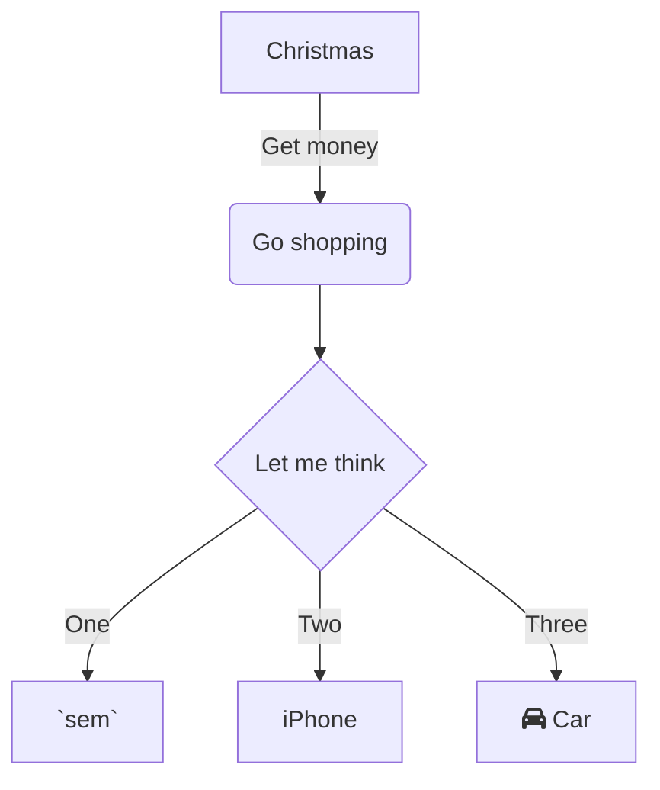

Link to swimms: :link: doc: [⚙️ How to Add a New User Configuration Value](https://swimm-web-app.web.app/workspaces/31mTaeNvhmm94YCmlmlG/repos/Z2l0aHViJTNBJTNBcGFuZGFzJTNBJTNBbmFkYXYtc3dpbW0=/branch/some-branch-for-doron/docs/fa7z2).

 

this doc is about ...

all the component are stored under: `📄 pandas/_libs/tslibs/src`

[⚙️ How to Add a New User Configuration Value](how-to-add-a-new-user-configuration-value.fa7z2.sw.md)

[[sym-mention:(a80ea568-2fa3-44ee-871e-07e135055165|1A52Ay)nadav]]

 

<!--MERMAID {width:100}-->

<!--MCONTENT {content: "graph TD \nA\\[Christmas\\] \\-\\-\\>|Get money| B(Go shopping) \nB \\-\\-\\> C{Let me think} \nC \\-\\-\\>|One| D\\[`sem`<swm-token data-swm-token=\":pandas/core/window/expanding.py:508:3:3:`    def sem(self, ddof: int = 1, *args, **kwargs):`\"/>\\] \nC \\-\\-\\>|Two| E\\[iPhone\\] \nC \\-\\-\\>|Three| F\\[fa:fa-car Car\\] "} --->

 

 

 

* * *

Have any questions? Check out [Swimm docs](https://docs.swimm.io/) and [join our Slack Community](https://swimm.io/slack).

 

This file was generated by Swimm. [Click here to view it in the app](https://swimm-web-app.web.app/repos/Z2l0aHViJTNBJTNBcGFuZGFzJTNBJTNBbmFkYXYtc3dpbW0=/docs/6uxiw).
