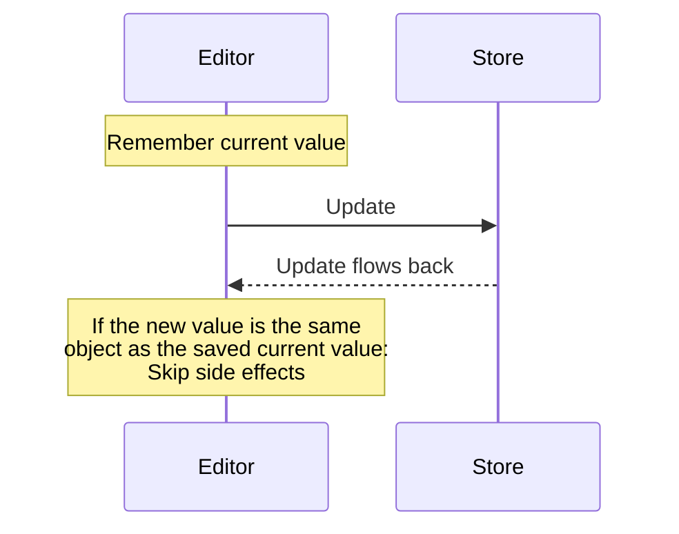

&nbsp;

&nbsp;


```mermaid
sequenceDiagram
note over Editor: Remember current value
Editor ->> Store: Update
Store -->> Editor: Update flows back
note over Editor: If the new value is the same <br/>object as the saved current value: <br/>Skip side effects
```

```mermaid

```

<SwmMeta repo-id="Z2l0aHViJTNBJTNBcGFuZGFzJTNBJTNBbmFkYXYtc3dpbW0=" repo-name="pandas"><sup>Powered by [Swimm](http://localhost:5001/)</sup></SwmMeta>
